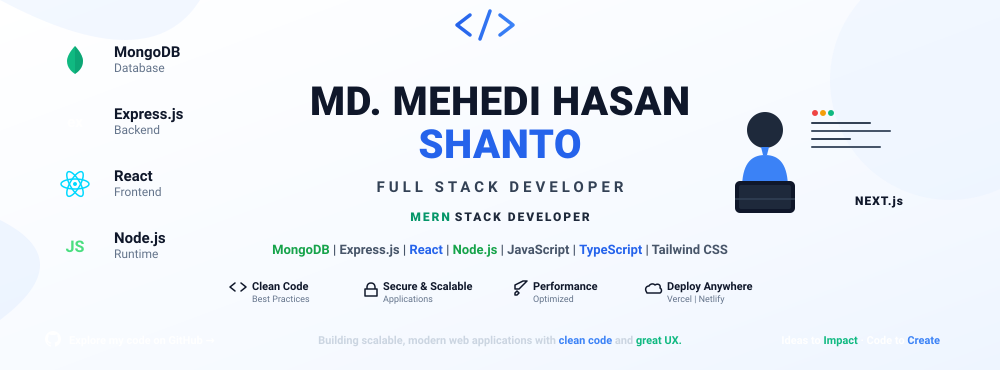

<!-- ===================================================== -->
<!-- HERO BANNER -->
<!-- ===================================================== -->

<p align="center">
  
</p>

<!-- TYPING ANIMATION -->

<h1 align="center">
  
</h1>

<p align="center">
  <strong>Full Stack (MERN Stack) Developer</strong> 🚀 <br/>
  Building modern, scalable, responsive, and user-focused web applications.
</p>

---

## 🔗 Connect with Me

<p align="center">
  <a href="https://www.linkedin.com/in/mh-shanto" target="_blank">
    
  </a>
  <a href="https://mhshanto-dev.vercel.app/" target="_blank">
    
  </a>
  <a href="https://daily.dev/mhshantodev" target="_blank">
    
  </a>
  <a href="https://x.com/mhshanto8989" target="_blank">
    
  </a>
  <a href="https://mail.google.com/mail/?view=cm&fs=1&to=mhshanto.8989.t@gmail.com" target="_blank">
    
  </a>
</p>

---

## 👨‍💻 About Me

* 🎓 I am a passionate **Computer Science student** and aspiring **Full Stack Developer**, focused on building modern and scalable web applications.
* 💻 I work with **JavaScript, TypeScript, React.js, Next.js, Node.js, Express.js, MongoDB**, and modern full-stack technologies.
* ⚡ **How I work:** I focus on clean code, reusable components, responsive design, API integration, authentication, performance, and maintainable project architecture.
* 🧠 I continuously improve my programming and problem-solving skills through practical projects, documentation, and consistent learning.
* 📚 Currently sharpening my expertise through **Programming Hero Batch 13** and **CSE Phitron**.
* 🤖 I use AI-assisted development tools to improve productivity, explore solutions, understand documentation, and solve problems more efficiently.
* 🚀 My goal is to become a professional **Full Stack Developer** and build production-ready applications that solve real-world problems.
* 💼 **Open to:** Junior **Full Stack Developer**, **Frontend Developer**, and entry-level software development opportunities.

---

## 🛠 Tech Stack & Tools

<table>
  <tr>
    <td align="center" width="25%"><strong>Frontend</strong></td>
    <td align="center" width="25%"><strong>Backend & Database</strong></td>
    <td align="center" width="25%"><strong>Authentication & UI</strong></td>
    <td align="center" width="25%"><strong>Tools & Platforms</strong></td>
  </tr>
  <tr>
    <td>
      HTML5, CSS3, JavaScript (ES6+), TypeScript, React.js, Next.js, React Router, Context API, TanStack Query, Tailwind CSS
    </td>
    <td>
      Node.js, Express.js, MongoDB, RESTful APIs, CRUD Operations, Server-side Validation
    </td>
    <td>
      Better Auth, Firebase Authentication, JWT, HeroUI, Material UI, Bootstrap, DaisyUI, Framer Motion, React Hook Form
    </td>
    <td>
      Git, GitHub, VS Code, Postman, Figma, Chrome DevTools, npm, Vercel, Netlify, ESLint, Prettier
    </td>
  </tr>
</table>

<p align="center">
  
</p>

---

## 🚀 Featured Projects

| Project Name | Live Demo | Code Repository | Core Stack | Key Highlights |
| :--- | :--- | :--- | :--- | :--- |
| **🏥 MediCare Connect** | [Live Link](https://frontend-orpin-eight-50.vercel.app/) | [Client](https://github.com/mhshanto-dev/MedicareConnect) · [Server](https://github.com/mhshanto-dev/MedicareConnect-Server) | Next.js 15, Node.js, Express.js, MongoDB, Better Auth, Stripe | Healthcare appointment platform with patient/doctor/admin dashboards, JWT & Google auth, Stripe payments, and digital prescriptions. |
| **📚 StudyNook** | [Live Link](https://studynook-client-bice.vercel.app/) | [Client](https://github.com/mhshanto-dev/assignment-9) · [Server](https://github.com/mhshanto-dev/assingment-9-server) | Next.js 16, React 19, Node.js, Express.js, MongoDB, Better Auth, HeroUI | Study room booking platform with room management, booking system, Google sign-in, and a fully responsive HeroUI interface. |
| **📄 ResumePilot** | [Live Link](https://resumepilot-eight.vercel.app/) | [Repository](https://github.com/mhshanto-dev/AI-Resume-Builder-complete) | Next.js, React, TypeScript, MongoDB, Clerk Auth, Google Gemini AI | AI-powered resume & portfolio builder — extracts skills/experience from uploaded PDFs, generates AI summaries, and creates shareable portfolios. |
---

# 🔥 GitHub Streak

<p align="center">
  <a href="https://github.com/mhshanto-dev">
    
  </a>
</p>

---

# 📊 GitHub Analytics

<p align="center">
  <a href="https://github.com/mhshanto-dev">
    
  </a>
</p>

<p align="center">
  <a href="https://github.com/mhshanto-dev">
    
  </a>
  <a href="https://github.com/mhshanto-dev">
    
  </a>
</p>

---

# 📈 Contribution Graph

<p align="center">
  <a href="https://github.com/mhshanto-dev">
    
  </a>
</p>

---

## 📫 Reach Out

I am actively working toward becoming a professional full-stack developer. I enjoy learning new technologies, building real-world projects, solving problems, and continuously improving my development skills.

If you are interested in collaboration, development opportunities, or simply want to connect, feel free to reach out.

📧 **Email:** [mhshanto.8989.t@gmail.com](mailto:mhshanto.8989.t@gmail.com)

🌐 **Portfolio:** [mhshanto-dev.vercel.app](https://mhshanto-dev.vercel.app/)

💬 **WhatsApp:** [+880 1871-758989](https://wa.me/8801871758989?text=Hi%20Shanto%2C%20I%20saw%20your%20GitHub%20profile...)

---

## 🧠 Developer Snapshot

```javascript
const shanto = {
  name: "Md. Mehedi Hasan Shanto",
  pronouns: "he/him",

  role: "Full Stack Developer (MERN Stack)",

  education: {
    field: "Computer Science & Engineering",
    learning: [
      "Programming Hero Batch 13",
      "CSE Phitron"
    ]
  },

  specialization:
    "Building scalable, secure, responsive, and user-focused web applications",

  techStack: {
    frontend: [
      "HTML5",
      "CSS3",
      "JavaScript (ES6+)",
      "TypeScript",
      "React.js",
      "Next.js",
      "React Router",
      "Context API",
      "TanStack Query",
      "Tailwind CSS"
    ],
    backend: [
      "Node.js",
      "Express.js",
      "MongoDB",
      "RESTful APIs",
      "CRUD Operations",
      "Server-side Validation"
    ],
    authentication: [
      "Better Auth",
      "Firebase Authentication",
      "JWT"
    ],
    ui: [
      "HeroUI",
      "Material UI",
      "Bootstrap",
      "DaisyUI",
      "Framer Motion",
      "React Hook Form"
    ],
    programming: [
      "Python",
      "C",
      "C++",
      "OOP"
    ]
  },

  tools: [
    "Git",
    "GitHub",
    "VS Code",
    "Postman",
    "Figma",
    "Chrome DevTools",
    "npm",
    "Vercel",
    "Netlify",
    "ESLint",
    "Prettier"
  ],

  aiWorkflow: [
    "ChatGPT",
    "AI-Assisted Development"
  ],

  focus: [
    "Full Stack Development",
    "REST API Integration",
    "Authentication & Authorization",
    "Responsive UI/UX",
    "Clean Architecture",
    "Problem Solving"
  ],

  currentLearning: [
    "Advanced TypeScript",
    "Next.js",
    "Backend Development",
    "MongoDB",
    "AI Integration"
  ],

  goals2026: [
    "Complete 20 Projects",
    "Master AI Integration",
    "Land First Developer Job",
    "Build SaaS Product",
    "Open Source Contribution"
  ],

  challenge:
    "Building production-ready MERN applications while continuously improving my skills and solving real-world problems."
};
```

---

## 🎯 2026 Goals

<p align="center">
  
</p>

---

<p align="center">
  <strong>💻 Code. Learn. Build. Repeat. 🚀</strong>
</p>

<p align="center">
  <i>Me vs Me ✦ Relentless Learner</i>
</p>
